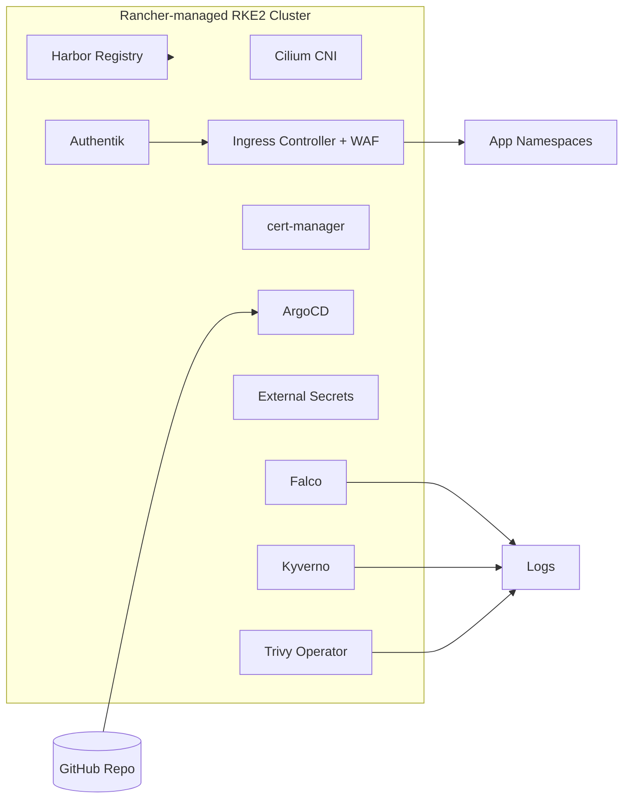

# Homelab Platform Stack — Kubernetes + GitOps + Zero Trust

> Rancher-managed Kubernetes • Cilium CNI • Ingress WAF • cert-manager • Harbor registry • ArgoCD GitOps • Authentik SSO • External Secrets • Falco & Kyverno • Trivy Operator

[](#license)


This repo contains the **platform foundation** for the homelab — everything that runs *on top of Proxmox/TrueNAS* but *underneath application stacks*. It provides **secure, reproducible Kubernetes** with GitOps, supply chain security, and built-in observability hooks.

---

## ✨ Highlights
- **Rancher + RKE2** for Kubernetes lifecycle & management
- **Cilium CNI** with eBPF, mTLS, and NetworkPolicies (deny-by-default)
- **Ingress** with WAF (NGINX+ModSecurity or Caddy+ForwardAuth)
- **cert-manager** for TLS (internal CA or Let’s Encrypt)
- **Harbor** as OCI registry with Cosign signing & Trivy scanning
- **ArgoCD** GitOps for declarative deployments
- **External Secrets** syncing with Vaultwarden
- **Falco & Kyverno** for runtime detection + policy enforcement
- **Trivy Operator** for in-cluster vulnerability & compliance scans
- **Authentik** for Single Sign-On across services

---

## 🧭 High-Level Architecture



---

## 📁 Repo Layout

```
platform-stack/
├─ README.md
├─ .env.example
├─ kubernetes/
│  ├─ cni-cilium/
│  ├─ ingress-waf/
│  ├─ cert-manager/
│  ├─ harbor/
│  ├─ argocd/
│  ├─ external-secrets/
│  ├─ falco/
│  ├─ kyverno/
│  ├─ trivy-operator/
│  └─ authentik/
├─ docs/
│  ├─ ONBOARDING.md
│  ├─ SECURITY.md
│  ├─ SUPPLY-CHAIN.md
│  ├─ NETWORKING.md
│  └─ GITOPS.md
└─ .gitignore
```

---

## 🚀 Quick Start

1. **Provision cluster** (Rancher + RKE2 nodes on Proxmox).
2. **Install Cilium**:
   ```bash
   helm upgrade --install cilium cilium/cilium -f kubernetes/cni-cilium/values.yaml
   ```
3. **Install Ingress + cert-manager**:
   ```bash
   helm upgrade --install ingress-nginx ingress-nginx/ingress-nginx -f kubernetes/ingress-waf/values.yaml
   helm upgrade --install cert-manager jetstack/cert-manager -f kubernetes/cert-manager/values.yaml
   ```
4. **Deploy Harbor & ArgoCD**:
   ```bash
   helm upgrade --install harbor harbor/harbor -f kubernetes/harbor/values.yaml
   helm upgrade --install argocd argo/argo-cd -f kubernetes/argocd/values.yaml
   ```
5. **Enable security controllers**:
   ```bash
   helm upgrade --install falco falcosecurity/falco -f kubernetes/falco/values.yaml
   helm upgrade --install kyverno kyverno/kyverno -f kubernetes/kyverno/values.yaml
   helm upgrade --install trivy trivy-operator/trivy-operator -f kubernetes/trivy-operator/values.yaml
   ```
6. **Set up Authentik** with Helm and configure ingress.

---

## 🔐 Security & Supply Chain

- **WAF** protects ingress traffic.
- **Cilium mTLS** secures east-west.
- **Kyverno** enforces policies: no `latest`, probes required, drop caps, seccomp.
- **Falco** detects runtime anomalies.
- **Trivy Operator** scans workloads & reports CVEs.
- **Harbor + Cosign** → signed & verified images.
- **ArgoCD + GitHub** → declarative GitOps with policy gates.

---

## 📊 Monitoring & Observability

- Falco → Wazuh/SOC integration
- Kyverno → policy violation logs → Loki
- Trivy Operator → compliance reports → Obsidian vault + Grafana dashboards
- Harbor → built-in vulnerability scanning
- Prometheus/Grafana stack overlays in `observability-stack` repo

---

## 📌 Roadmap

- Add **Linkerd service mesh** profile for stricter mTLS + deny-by-default.
- Expand **OPA/Conftest CI gates** in GitHub Actions.
- Create **ArgoCD app-of-apps** for full platform bootstrap.
- Document node taints/affinity for FatTwin mapping.

---

## 🔗 Related Stacks

- [Infrastructure Stack](../homelab-infrastructure-stack)
- [Security SOC Stack](../homelab-security-soc-stack)
- [Media Stack](../homelab-media-stack)

---

## 📝 License
MIT — see `LICENSE`.
